# Hi, I'm Dohyung Kim

Undergraduate student interested in **manufacturing & logistics optimization**.  
Studying simulation, reinforcement learning, and neural operators to build intelligent systems for factory and logistics operations.

---

## 🎯 Goal

> Targeting roles in **factory simulation, logistics optimization, and capacity verification**  
> in manufacturing industries.

---

## 🔧 Tech Stack

**Comfortable with**

**Learning**

---

## 📂 Study Repositories

| Repository | Description |
|---|---|
| [neural-operator-study](https://github.com/snake0u0/neural-operator-study) | DeepONet, FNO 등 뉴럴 오퍼레이터 공부 |
| [rl-optimization-study](https://github.com/snake0u0/rl-optimization-study) | RL 기반 스케줄링 최적화 공부 |
| [flexsim-study](https://github.com/snake0u0/flexsim-study) | FlexSim 시뮬레이션 모델링 공부 — 제조·물류 중심 |

---

## 🚀 Portfolio

| Repository | Description |
|---|---|
| [fab-logistics-portfolio](https://github.com/snake0u0/fab-logistics-portfolio) | 제조 물류 최적화 프로젝트 — 시뮬레이션 · RL 디스패칭 · Surrogate Model |

---

## 🗺️ Learning Roadmap

```mermaid
graph LR
    A[FlexSim\nFactory Simulation] --> D[Manufacturing & Logistics\nOptimization]
    B[RL · Optimization\nDispatching] --> D
    C[Neural Operator\nSurrogate Model] --> D
    D --> E[제조·물류\n시뮬레이션 최적화 직무]
```

---

## 📝 Blog

---

## 📬 Contact

